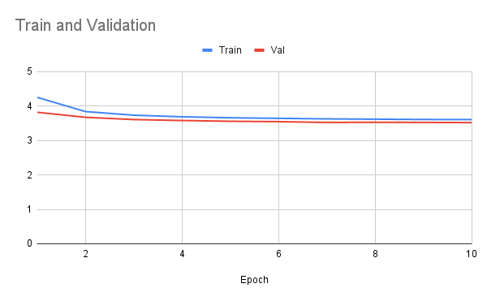

[](LICENSE)
[](https://huggingface.co/khotveer1/custom-gpt-pytorch-shakespeare)

# 🚀 LoRA Fine-Tuned GPT-2 Medium on Shakespeare Data

This repository contains everything needed to reproduce and run a LoRA fine-tuned GPT-2 Medium model using PyTorch and 🤗 Hugging Face Transformers. The model was trained on Shakespeare plays and produces text in Shakespearean style.


### 🌐 Try the Model in Your Browser
🧪 Live Demo:
👉 [LoRA GPT-2 Shakespeare – Hugging Face Space](https://khotveer1-gpt2-shakespeare-ui.hf.space/?logs=container&__theme=system&deep_link=CpRQO5WGNOA)

A simple and elegant Streamlit app hosted on Hugging Face Spaces. You can input custom prompts and generate Shakespeare-style completions instantly in your browser.


### 📁 Project Structure

```bash 
.
├── saved_model/                             # Contains adapter config and model weights
├── 01_train_lora_gpt2_shakespeare.ipynb     # LoRA training notebook
├── 02_generate_text_with_lora_model.ipynb   # Text generation notebook using the fine-tuned model
├── requirements.txt                         # Python dependencies
└── README.md                                # Project documentation
```


### 🧠 Model Overview
- Base Model: gpt2-medium
- Fine-tuning Method: LoRA (Low-Rank Adaptation)
- Dataset: Shakespeare’s plays
- Frameworks: PyTorch, Hugging Face Transformers, PEFT

**The model and adapter are available on Hugging Face Hub:**
  
👉 [khotveer1/gpt2-medium-lora-finetuned-shakespeare](https://huggingface.co/khotveer1/gpt2-medium-lora-finetuned-shakespeare)


### 🛠 Installation
Create a virtual environment and install dependencies:
```bash
python -m venv venv
source venv/bin/activate  # or .\venv\Scripts\activate on Windows
pip install -r requirements.txt
```


### 📓 Notebooks

1. Training with LoRA
Run 01_train_lora_gpt2_shakespeare.ipynb to:

- Load gpt2-medium
- Apply LoRA using PEFT
- Train on Shakespeare text

3. Generate Text
Run 02_generate_text_with_lora_model.ipynb to:

- Load the fine-tuned model from Hugging Face
- Generate Shakespeare-style text from a custom prompt


### ✨ Quick Inference Example

```python
from transformers import AutoTokenizer, AutoModelForCausalLM

tokenizer = AutoTokenizer.from_pretrained("khotveer1/gpt2-medium-lora-finetuned-shakespeare")
model = AutoModelForCausalLM.from_pretrained("khotveer1/gpt2-medium-lora-finetuned-shakespeare")

prompt = "ACT I, SCENE I\nfirst citizen:"
inputs = tokenizer(prompt, return_tensors="pt")

outputs = model.generate(**inputs, 
                         max_length=80,
                         do_sample=True,
                         top_k=40,
                         temperature=0.8,
                         repetition_penalty=1.15)

print(tokenizer.decode(outputs[0], skip_special_tokens=True))
```

### Loss Curve

The model was trained for 10 epochs on the Shakespeare dataset. Both training and validation losses steadily decreased, showing consistent learning and convergence:




### 🔗 Resources

🧠 [Medium Article](https://medium.com/@khotveer1/mastering-lora-fine-tuning-gpt-2-for-domain-specific-texts-61847bef4732)

💻 [Hugging Face Model Page](https://huggingface.co/khotveer1/gpt2-medium-lora-finetuned-shakespeare)


### 📄 License

This project is licensed under the MIT License. See LICENSE file for details.


